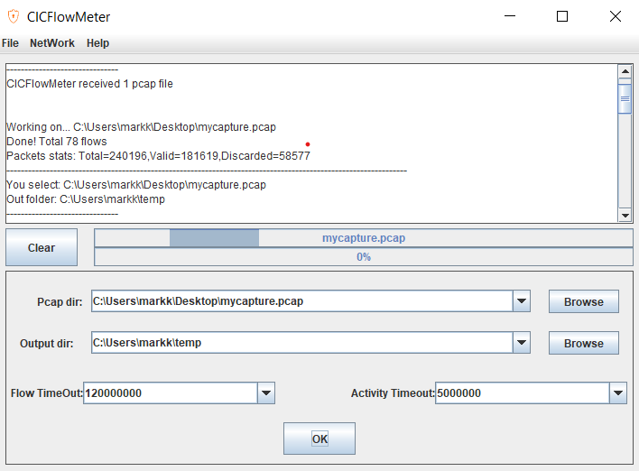

# Network Intrusion Detection exercises

## Task 1: Capture network traffic

**Installation of wireshark**

Use Wireshark to capture traffic to pcap. 

Instructions to open up the wireshark and capture traffic and save to pcap (not ngpcap) file

## Task 2: Extract network flow and features

**Installation notes of CICFlowMeter**
- Install winpcap 
- Install java 
- Unzip cicflowmeter

1. In the CICFlowMeter directory, runs the batch file "CICFlowMeter.bat"
2. Specify the pcap file you created in Task 1.
3. Specify the output directory (e.g. c:\temp)
4. Leave flow timeout and activity timeout at its default values
5. Click Ok. 

*Flow timeout note*

Note that TCP flows are usually terminated upon connection teardown (by FIN packet) while UDP flows are terminated by a flow timeout. 

